

# DAINS · Data Insight Studio

**对话式统计分析工作台 —— 您上传数据，AI 负责统计、建模与成文报告**

[在线体验](https://dains.cn) · [产品演示](#产品演示) · [反馈与问卷](#反馈与问卷)

*上传一份数据文件，AI Agent 负责统计、建模与成文报告；您只负责提问与决策。*

> DAINS 是非开源项目，本仓库不包含源代码，仅作为产品介绍门面——帮您在三分钟内了解它的背景、能力、架构与隐私立场，并引导您完成在线端测试。

**目录**：[DAINS 是什么](#dains-是什么) · [九大板块](#九大板块一个完整的分析闭环) · [5 分钟上手](#5-分钟上手在线体验指引) · [分析流程树](#一棵完整的分析流程树) · [产品架构](#产品架构) · [数据隐私与安全](#数据隐私与安全) · [产品演示](#产品演示) · [路线图](#路线图) · [当前状态](#当前状态与测试说明) · [反馈与问卷](#反馈与问卷)

## DAINS 是什么

DAINS（Data Insight Studio）是一个**对话式统计分析工作台**：把一份数据文件交给它，AI Agent 会完成统计探查、建模与成文报告；全过程 Python 沙箱真实执行，每一段结论都附上生成它的代码。

- **对话式**：用自然语言对数据提问，Agent 生成 Python 代码 → 沙箱执行 → 结果成文，一气呵成。
- **四位一体**：所有结论坚持**结论 · 大纲 · 依据 · 代码实证**同框呈现，每段结果都能下钻到生成它的代码——可信，是第一原则。
- **可沉淀**：分析步骤可存为工具、口径可存入习惯、结论可沉淀为看板——一次分析沉淀为可复用的知识资产。

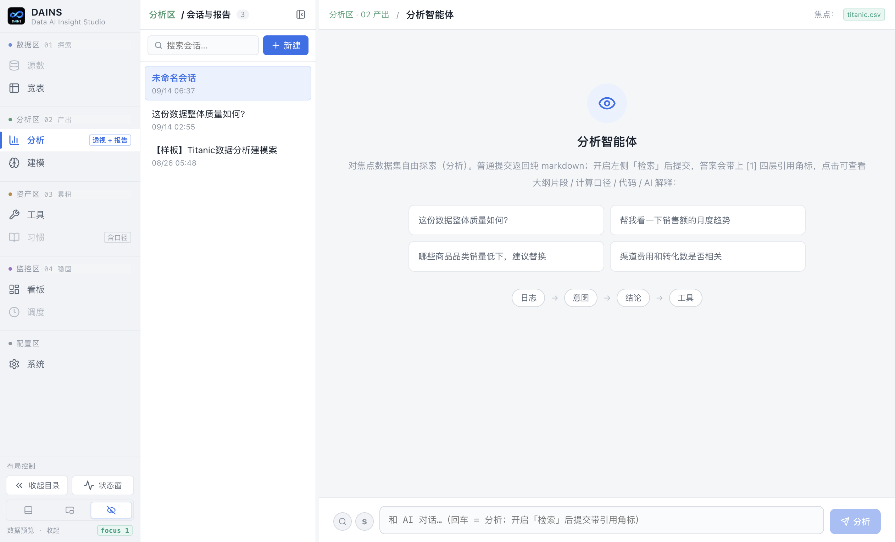

小贴士：在任意主功能页面**按住 Alt 键（macOS 为 Option）约 2 秒**，即可显示当前阶段各要素的功能说明。

## 九大板块：一个完整的分析闭环

九大板块构成完整闭环：**数据管理 → 宽表 → 分析 → AutoML → 工具 → 习惯 → 看板 → 调度**。

**1. 源数**（数据区）: 数据文件统一管理——双通道上传、类型白名单、N 级目录树、焦点勾选跨板块联动。

**2. 宽表**（数据区）: 上传即透视——新文件默认产出统计透视报告，逐字段类型识别、缺失画像、分布特征，点状计算一目了然。

**3. 分析**（产出区）: 主菜——AI 问数。普通/检索式两种提交、HITL 意图确认、报告带四层支撑（结论/大纲/依据/代码）、HTML 与 PDF 导出。

**4. 建模**（产出区）: 两阶段 AutoML——LightGBM + Optuna 自动调参、消融特征确认卡人工圈定、Markdown 流式成稿。

**5. 工具**（产出区）: 把套路沉淀下来——分析逻辑提炼为 in / out 标准化工具，换数据集一键复用；内置数据质量探查等工具。

**6. 习惯**（产出区）: 您的口径，DAINS 记住——个人习惯（偏好）+ 统计口径（计算约束）两层沉淀。

**7. 看板**（监控区）: 从一问一答到持续浏览——AI 一句话建板、19 种图表 + 6 种统计表、拖拽画布、只读链接免登录分享。

**8. 调度**（监控区）: 自动化动力源——看板定期刷新、外部数据定期抽送、临时文件定期清理。

**9. 系统**（配置区）: 账户 / 配置 / 问卷——产品功能计划板、问卷收集、欢迎文档与使用文档。

| 宽表 · 上传即透视 | 分析 · HITL 意图确认 |
|---|---|
| 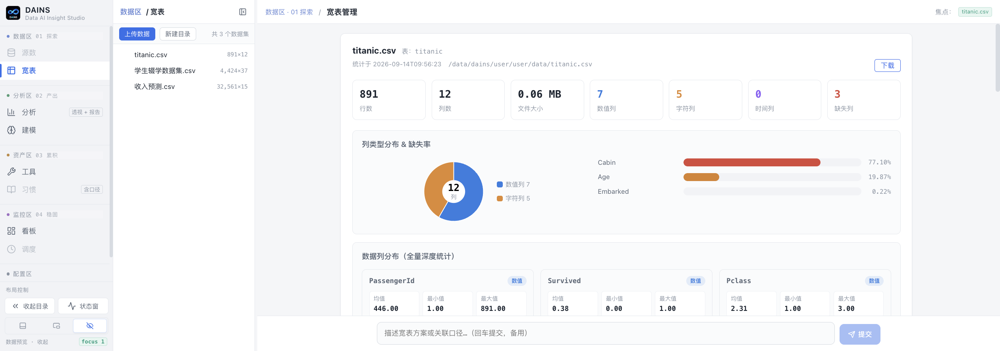 | 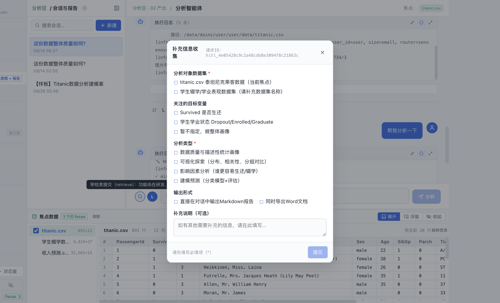 |

| 建模 · 两阶段参数盘 | 看板 · 拖拽画布 |
|---|---|
| 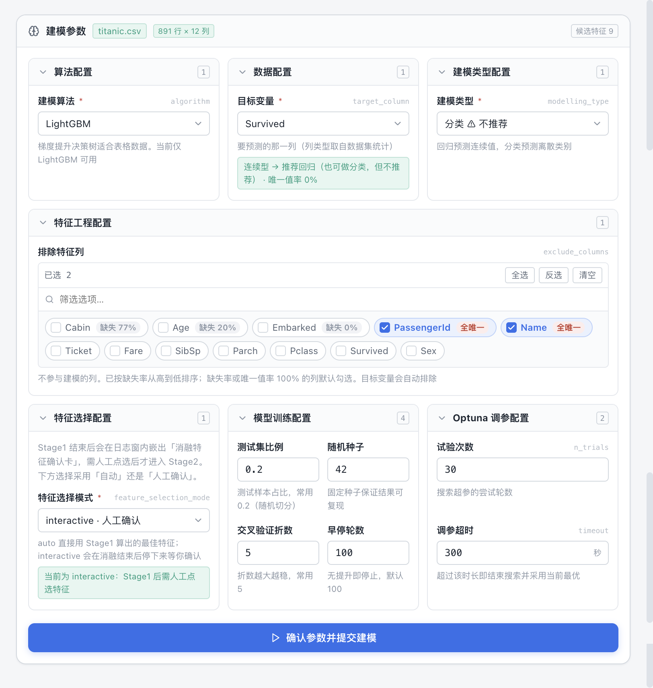 | 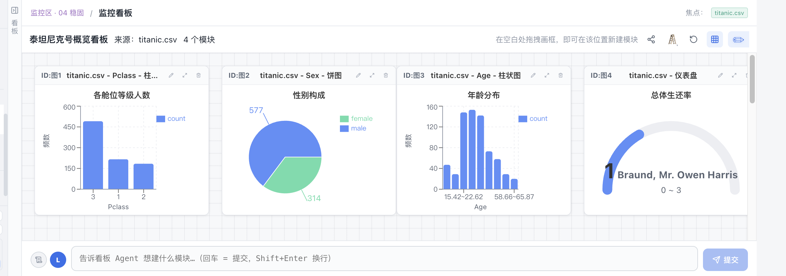 |

## 5 分钟上手（在线体验指引）

打开 **[dains.cn](https://dains.cn)** 注册登录后，推荐按这条路径走一遍：

**① 上传数据 → 宽表自动透视**
在【源数】上传任意 CSV / Excel，切到【宽表】：类型识别、缺失率、分布特征已经算好摆在面前，一行代码都不用写。

**② 对着数据提问 → 分析智能体**
切到【分析】，选定焦点数据集，用白话提问（例如「这份文档整体质量如何？」「帮我看看销售额的月度趋势」）。Agent 弹出**意图确认卡**（HITL）帮您补全分析对象、目标变量与输出形式，确认后进入执行。

**③ 读懂答案 → 四位一体**
答案按「结论 · 大纲 · 依据 · 代码实证」组织：正文引用角标点击即可展开**该段结论实际执行的 Python 代码**与 AI 解释；支持导出 HTML（溯源）与 PDF（交付）。

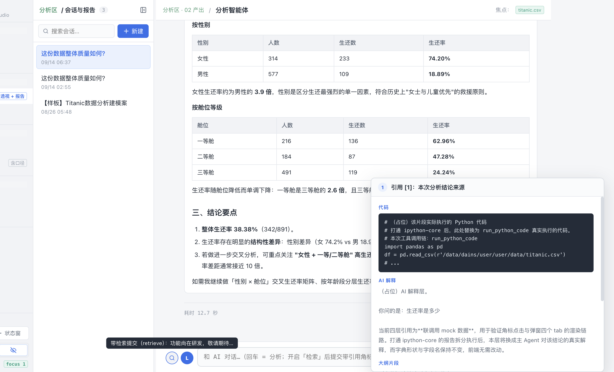

**④ 沉淀复用 → 工具与习惯**
把跑通的分析步骤存为**多步骤工具**，换一份焦点数据集原样复用；把「保留两位小数」「某字段单位是分还是元」这类偏好与口径记入【习惯】。

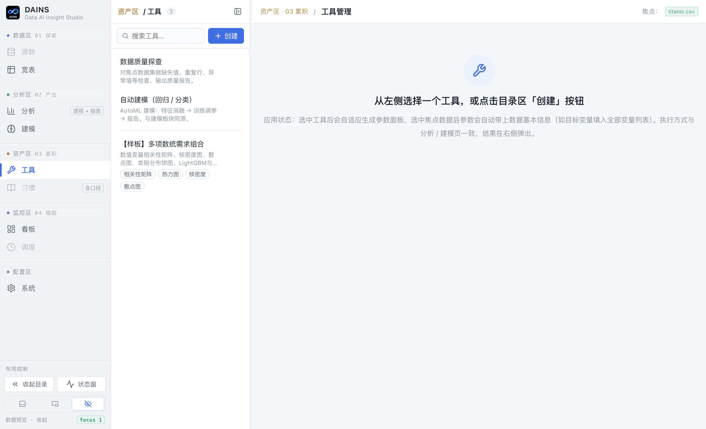

**⑤ 进入稳态 → 看板与调度**
分析充分展开后，让**看板 Agent** 把结论组装成模块化看板（拖拽布局、19 种图表可选），生成只读链接分享给同事——免登录即可浏览。

## 一棵完整的分析流程树

从上传到稳态，一棵流程树看懂 DAINS 的完整能力链：

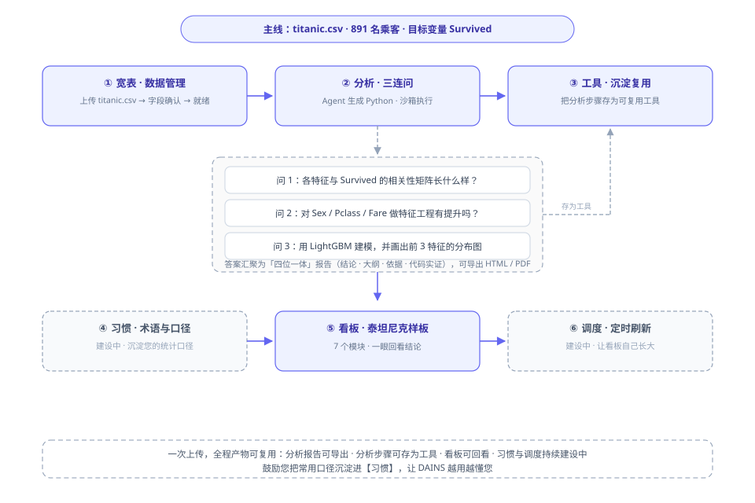

一次上传，全程产物可复用：**分析报告可导出 · 分析步骤可存为工具 · 看板可回看**。鼓励您把常用口径沉淀进【习惯】，让 DAINS 越用越懂您。

## 产品架构

后端四个服务（**API 服务 · AI Agent · Python 沙箱 · 调度器**）由 supervisor 统一管控，接入层由 Cloudflare Tunnel + NGINX 承担。

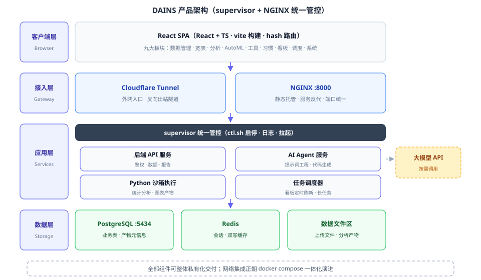

**网络链路**：浏览器 → Cloudflare Tunnel → NGINX → 后端服务 → 大模型 API。服务仅监听本机端口，隧道由内向外出站建连，**服务器无需暴露任何入站端口**；大模型 API Key 加密存放于服务端，仅在您发起分析时发送必要的统计摘要与提示词。

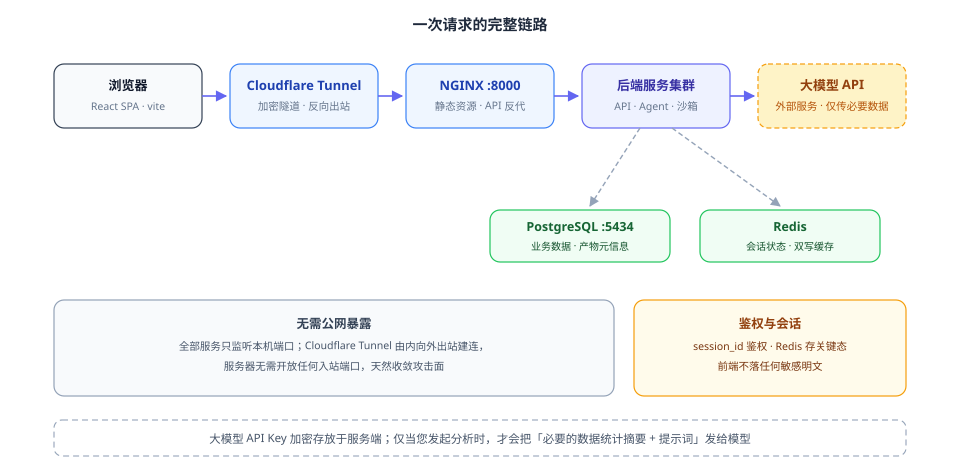

| 层 | 技术选型 |
|---|---|
| 客户端 | React + TypeScript + Vite |
| 接入层 | Cloudflare Tunnel + NGINX |
| 应用层 | Python Flask 多服务（supervisor 管控）|
| AI 层 | 多模型路由（DeepSeek / SiliconFlow / OpenRouter / Ollama…）+ Python 沙箱真实执行 |
| 数据层 | 文件系统 + PostgreSQL + Redis |
| 建模 | LightGBM + Optuna（两阶段 AutoML）|

## 数据隐私与安全

从上传到删除，数据的每个停留点都**可见、可查、可清**：

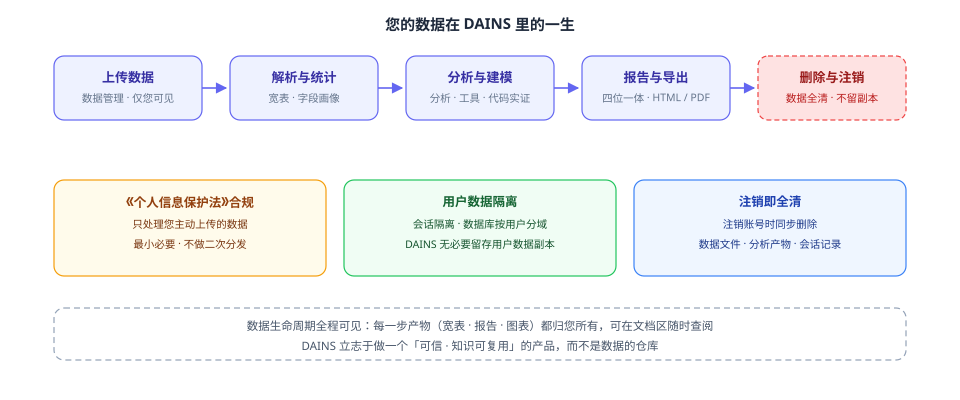

**您的数据只存在于三处**：文件系统（上传文件与分析产物）、PostgreSQL（业务元信息）、Redis（会话状态），除此之外无任何副本。

> **数据隐私承诺**
>
> DAINS 熟知《个人信息保护法》等数据安全法规，**完全依法处理数据，且无必要留存用户任何数据**——分析在您的数据上就地完成，产物归您所有。
>
> 唯一例外是**问卷收集信息**：那是 DAINS 最宝贵的财产，仅用于产品改进。
>
> 注销账号即触发**全清**：数据文件、分析产物、会话记录一并删除，不留残余。

## 产品演示

**🎬 产品演示视频 · 展示视频录制中...**

*敬请期待——完整的操作引导视频将在此处上线。*

## 路线图

| 方向 | 内容 |
|---|---|
| **看板与自动化** | 图表体系完善、看板 Agent、分享与导出、定时跑批与异动叙事播报 |
| **数据接入与宽表** | 多表关联、NL2SQL 与上游数据接入、轻量 ETL |
| **分析 Agent 深化** | 长任务拆解执行、口径召回、交叉验证与大模型审核机制、R 语言支持 |
| **工具与资产生态** | 工具市场与方案模板包、统一资产抽象（工具 / 口径 / 看板 / 调度）|
| **产品化交付** | Docker Compose 私有化、Windows 打包分发、License 授权体系 |

## 当前状态与测试说明

- 当前版本为**能力预览版（Beta，公测期）**，以线上方式提供服务；产品级私有化交付（Docker Compose / Windows 桌面版）是明确的落地方向。
- 公测期网络经 **Cloudflare 中转**，访问时遇到「网速慢」「闪断」属正常现象；正式 DAINS 产品不走外网，不会遇到此情况。
- 能力预览版按「现状」提供，不承诺服务连续性；**重要分析结果请及时导出留存**。
- AI 生成的统计结论仅供决策参考，正式用途请以人工复核后的结果为准。
- 欢迎用您自己的真实业务数据做测试——上传即用，无需任何配置。

## 反馈与问卷

DAINS 为个人 OPC（One Person Company）项目，使用过程中难免遇到 bug——请您在 **xx-xx** 处填写 bug 报告（接受截图），每一条都会被认真对待、逐条跟进。

**2027 年前，DAINS 最关心的是用户问卷。**

诚挚邀请您花三分钟填写问卷：登录 [dains.cn](https://dains.cn) 后，进入左侧【系统】板块的【问卷收集】。功能期待、使用障碍、建议与意见，都是产品演进的第一手依据——您的每一条反馈都会进入产品功能计划板。

感谢您试用 DAINS：愿每一次分析，都**可信、可复用、可沉淀**。

## License

© 2026 DAINS. All Rights Reserved.

本项目为闭源软件，本仓库不含任何源代码；未经授权，请勿将本仓库中的文案与图片用于商业用途。

**[dains.cn](https://dains.cn) —— 上传一份数据，开始第一次对话式分析**

